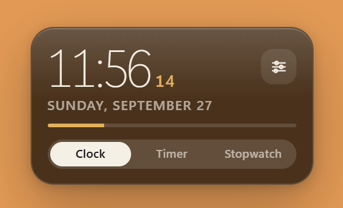
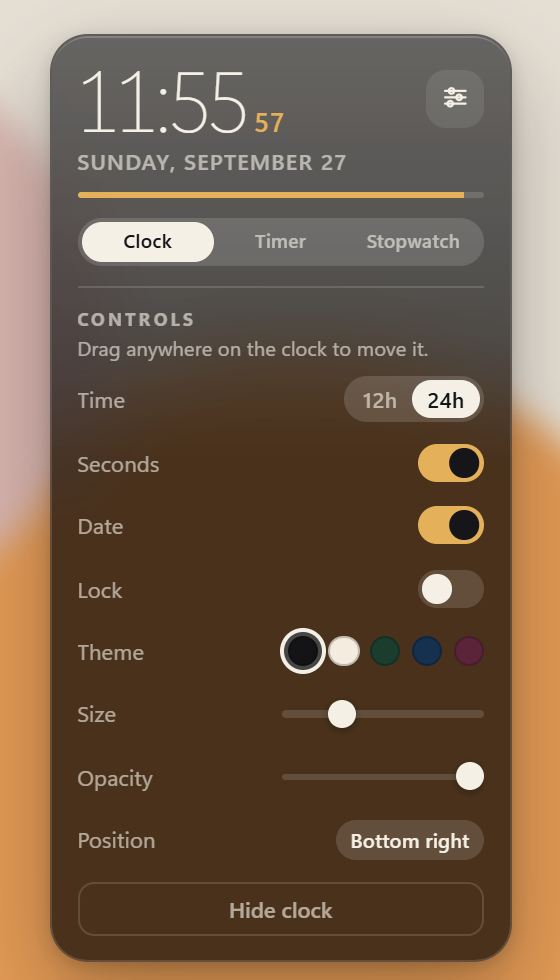
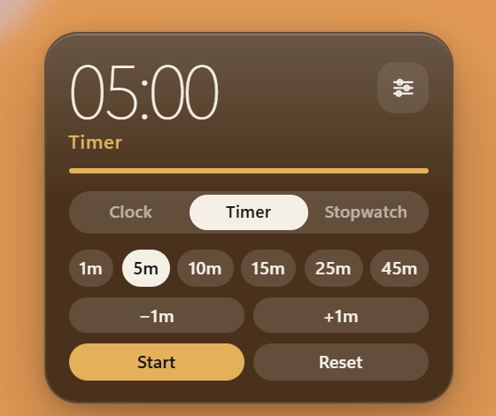
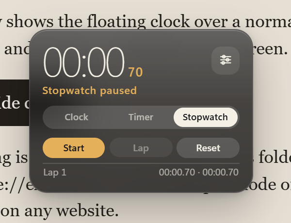

# Floating Clock

A Chrome extension. Click the toolbar icon and a clock floats on any website. Drag it wherever you want. Clock, timer, and stopwatch live on the same card.

## Clock

Time, seconds, and the date. **Clock**, **Timer**, and **Stopwatch** sit along the bottom.

## Settings

The button on the right opens the controls.

- **12h / 24h** — time format
- **Seconds** — show or hide seconds
- **Date** — show or hide the date
- **Lock** — when on, the clock cannot be dragged
- **Theme** — Ink, Paper, Moss, Sea, Rose
- **Size** — card size
- **Opacity** — how see-through the card is
- **Bottom right** — snap it back to the bottom-right corner
- **Hide clock** — hide it

## Timer

Presets: **1m, 5m, 10m, 15m, 25m, 45m**. **−1m** and **+1m** adjust the time (minimum 15 seconds, maximum 6 hours). **Start**, **Pause**, and **Reset**. A progress bar runs while it counts down. It beeps when time is up.

## Stopwatch

**Start**, **Pause**, **Lap**, and **Reset**. Time shows minutes, seconds, and hundredths. Each lap lists that split and the total. Up to 12 laps.

## What it does

- Click the icon to show or hide the clock. The badge reads **ON** while it is visible. Shortcut: **Alt+Shift+C**.
- Drag the card anywhere. Position, theme, size, and the rest of the settings are saved, so they stay the same when you change pages.
- A running timer or stopwatch keeps going when you open another page. Hiding the clock does not stop it.
- Closing the last Chrome window pauses the timer and stopwatch immediately. Time spent with Chrome closed is not counted, and it does not beep while Chrome is closed. Open Chrome again and press **Start** to continue from where it stopped.
- Closing one window while another stays open does not pause it.
- It does not run on `chrome://` pages. It runs on normal websites.

Settings and timer state stay in this browser. Nothing is sent anywhere.

## Run it in Chrome

1. Open `chrome://extensions`.
2. Turn on **Developer mode**.
3. Click **Load unpacked** and choose this folder.
4. Click the clock icon in the toolbar.

After you change the code, click **Reload** on that same page.
